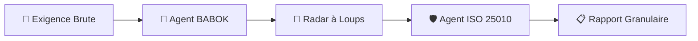

# 🏗️ Architecture Technique : Augmented BID IA (V2.1)

Ce document détaille le fonctionnement interne, notamment la nouvelle chaîne de montage des Micro-Agents.

---

## 📊 1. Chaîne de Montage Granulaire (Micro-Agents)

Lors de l'audit stratégique, chaque exigence passe par un pipeline de trois agents spécialisés :

### 🧠 Logique des Agents :
1.  **Agent BABOK (Normalisation)** : Transforme le langage naturel en structure atomique : `Condition + Sujet + Action + Objet + Contrainte`. Il élimine les ambiguïtés de responsabilité.
2.  **Radar à Loups (Désambiguïsation)** : Calcule un score d'ambiguïté (0-100) en traquant les termes qualitatifs non mesurables.
3.  **Agent de Complétude (ISO 25010)** : Utilise le cadre de qualité logicielle ISO 25010 pour identifier les transitions d'états manquantes (ex: une fonction de création sans fonction de suppression).

---

## 🧠 2. Moteur de Recherche Hybride (RRF)

Le système fusionne deux index pour une précision maximale :
- **ChromaDB** : Recherche sémantique (Vecteurs).
- **BM25** : Recherche par mots-clés exacts (Algorithme de ranking textuel).
**Fusion RRF** : Les résultats bien classés dans les deux moteurs remontent en priorité.

---

## 🛠️ Stack Technique Mise à jour
- **LLM** : Ollama (Qwen 2.5 / Llama 3.2 Vision).
- **Orchestration** : Micro-Agents personnalisés (Python).
- **Normes** : BABOK (Business Analysis), ISO 25010 (Qualité Logicielle).
- **Vector DB** : ChromaDB.
- **Parsing** : IBM Docling.

---

🔒 **Robustesse** : Utilisation de cache de fragments (`.fragments.json`) et IDs MD5 déterministes pour éviter les doublons et accélérer le traitement.
