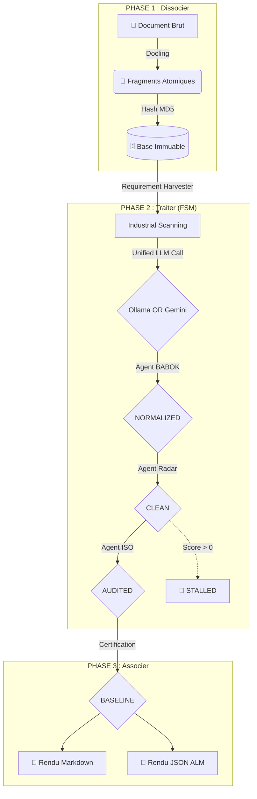

# 🏗️ Architecture Déterministe : FSM-Driven Engine

Ce document décrit l'organisation de l'Usine à RFP basée sur une Machine à État Finis.

---

## 📊 1. Modèle Conceptuel (L'Usine en 3 Phases)

---

## 🎨 2. Certification & Produits de Sortie (Output Node)

La Phase 3 génère deux artefacts certifiés dès que l'état **BASELINE** est atteint :

### A. Le Livrable Humain (`technical_baseline_final.md`)
Un document structuré pour les décideurs et les architectes. Il contient la matrice MoSCoW, le score d'intégrité Reverse TOGAF et le catalogue complet des exigences validées.

### B. Le Livrable Machine (`technical_baseline_alm.json`)
Un fichier structuré avec tous les attributs techniques (UID, Sujet, Action, Objet, Contrainte). Ce fichier est conçu pour être importé par script dans des outils de gestion des exigences (ALM).

---

## 🛠️ 3. Intégrité, Sûreté & Observabilité

- **Project UID :** Le sceau d'immuabilité (ALM-XXXX) est un hash calculé sur l'intégralité des exigences certifiées. Toute modification ultérieure briserait cette signature.
- **Fail-Safe :** Une exigence ne peut atteindre l'état BASELINE si son score d'ambiguïté en Phase 2 n'est pas strictement égal à zéro.
- **Observabilité :** Le système intègre un `factory_logger` (Phase 2 & 3) qui trace chaque événement industriel (début de scan, certification, erreurs de pipeline) pour une maintenance préventive facilitée.
