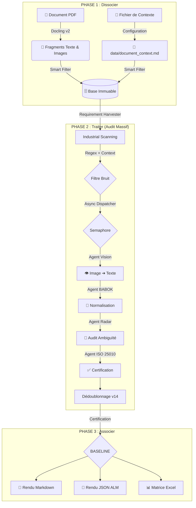

# 🏗️ Architecture Déterministe : FSM-Driven Engine (v14)

Ce document décrit l'organisation industrielle de l'Usine à RFP basée sur une Machine à État Finis, une exécution asynchrone et des capacités multimodales.

---

## 📊 1. Modèle Conceptuel (L'Usine en 3 Phases)

---

## ⚙️ 2. Le Cycle de Vie d'une Exigence (FSM)

Chaque fragment passe par un tapis roulant d'états :

| État | Robot Responsable | Description |
| :--- | :--- | :--- |
| **RAW** | `VisionAgent` | État initial. Transforme les images en texte brut si nécessaire. |
| **NORMALIZED**| `BABOKAgent` | Structure l'exigence : Sujet / Action / Objet (BABOK v3). |
| **CLEAN** | `WolfRadarAgent` | État atteint si le score d'ambiguïté est < 20. Sinon reste bloqué. |
| **AUDITED** | `ISO25010Agent` | Vérifie la complétude technique selon les standards ISO. |
| **BASELINE** | `Composer` | État final certifié. Éligible pour le catalogue de baseline. |
| **ERROR** | *Tous* | Exigence rejetée (Bruit, Hors-contexte, Administrative). |

---

## 🎯 3. L'Innovation `document_context.md` (Auto-Adaptatif)

Le pipeline v14 est devenu **100% agnostique et auto-adaptatif**. L'utilisateur décrit son document en texte libre dans `data/document_context.md`. Le système en déduit automatiquement :

- **Règles d'Extraction (`is_real_requirement`)** : Une liste noire stricte (8 règles) est croisée avec une règle positive de domaine.
- **Filtres de Bruit Hors-Domaine** : Si le domaine est 'IT', les exigences parlant de 'panneaux solaires' sont automatiquement ignorées avant même d'interroger le LLM.
- **Verbes Normatifs Dynamiques** : Détecte la langue (Fr/En) pour appliquer le bon filtre de verbes (`must/shall` vs `doit/devra`).
- **Détection d'ID** : Auto-détection des patterns d'identifiants (ex: `BN-XXX`).

---

## 🔍 4. Dédoublonnage Sémantique v14

Le `RequirementHarvester` utilise une stratégie robuste à deux niveaux pour garantir une unicité parfaite :
1.  **Par ID Officiel** : Si plusieurs fragments partagent le même identifiant (ex: `BN-044`), on conserve uniquement celui dont la citation est la plus riche et complète.
2.  **Par Préfixe Normalisé** : Pour les exigences sans ID, on compare les 80 premiers caractères de la citation normalisée.

---

## ⚡ 5. Performance & Observabilité

- **Asynchronisme (asyncio)** : Le `RequirementHarvester` traite les fragments en parallèle.
- **Sémaphores** : Contrôle du flux (par défaut 2 requêtes concurrentes) pour protéger la VRAM du GPU local.
- **Logs Industriels** : `factory_log.py` avec buffering pour une traçabilité totale des transitions FSM.
