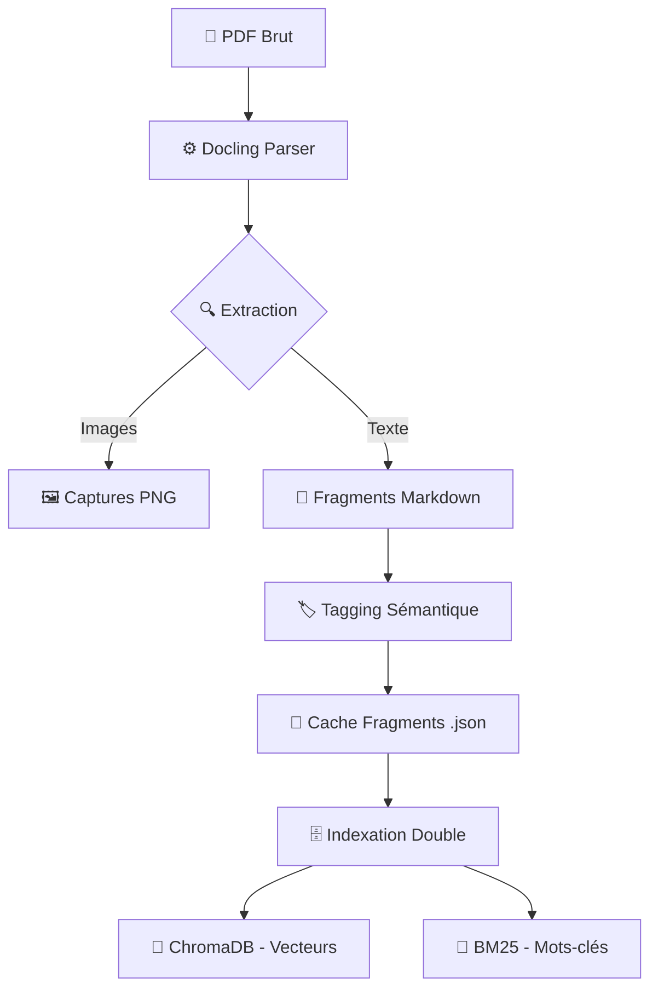

# 🏗️ Architecture Technique : Augmented BID IA (V2)

Ce document explique le fonctionnement interne du moteur d'analyse. Il est conçu pour être lu par des développeurs ou des architectes solutions.

---

## 📊 1. Flux de Données Global (Pipeline)

Voici comment un document PDF devient une réponse intelligente :



### Pourquoi ce flux ?
1.  **Docling** ne se contente pas de lire le texte, il comprend la **hiérarchie** (Titres, Tableaux).
2.  Le **Tagging Sémantique** classe automatiquement les données (ex: FINANCE, TECHNIQUE) pour que l'IA ne cherche pas une clause juridique dans la partie prix.
3.  Le **Cache** permet de ne pas re-parser un document déjà analysé (gain de temps > 95%).

---

## 🧠 2. Recherche Hybride & Fusion RRF

Pour garantir une précision maximale, nous utilisons deux moteurs de recherche en parallèle.

### Le concept de la Fusion (RRF) :
Si vous cherchez "Article 4.2 sur la sécurité", le moteur vectoriel comprend "sécurité" (sens), mais le moteur BM25 trouve "Article 4.2" (texte exact).

```text
REQUÊTE UTILISATEUR
       |
  ┌────┴────┐
  ▼         ▼
[VECTEURS] [BM25]  <-- Deux recherches indépendantes
  |         |
  ▼         ▼
[TOP 20]   [TOP 20] <-- Deux listes de résultats
  \         /
   \       /
    ▼     ▼
 [FUSION RRF]      <-- Calcul d'un score combiné
      |
      ▼
 [DÉCISION FINALE] <-- Les 5 meilleurs fragments
```

**La formule RRF (Reciprocal Rank Fusion)** : `Score = 1 / (60 + Rang_Vecteur) + 1 / (60 + Rang_BM25)`. 
Cela favorise les documents qui apparaissent en haut des deux listes.

---

## 🖼️ 3. Routage Multimodal (Texte vs Vision)

L'agent décide intelligemment quel "sens" utiliser pour répondre.

```text
QUESTION : "Explique le schéma page 5"
       |
       ▼
[🧠 ROUTEUR LLM] 
       |
       ├─► [INTENTION TEXTE] ──► [Génération Qwen 2.5]
       └─► [INTENTION VISION] ─┬► [Recherche Page PNG]
                               └► [Analyse Llama 3.2 Vision]
```

---

## 🛡️ 4. Gap Analysis (Analyse d'Écart)

C'est le cerveau de la Phase 2. Il compare deux mondes :

| Source A (Client) | Source B (Vous) | Résultat (IA) |
|:---:|:---:|:---:|
| **Exigence RFP** | **Votre Catalogue** | **Statut GTM** |
| "Besoin Support 24/7" | "Support 8h-18h" | ⚠️ PARTIEL |
| "Hébergement France" | "Data Center Paris" | ✅ CONFORME |

---

## 🛠️ Stack Technique
- **LLM** : Ollama (Qwen 2.5 / Llama 3.2 Vision)
- **Vector DB** : ChromaDB
- **Keywords** : Rank-BM25
- **Parsing** : IBM Docling
