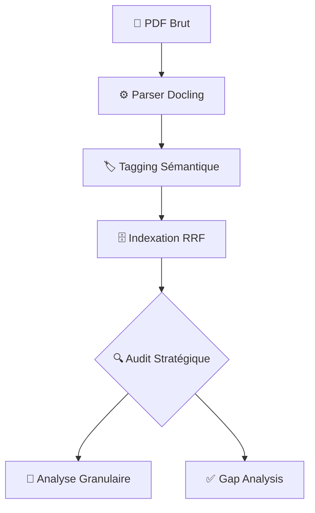

# 🏗️ Architecture Technique : Augmented BID IA (V2.1)

Ce document détaille l'ingénierie interne du système, de l'ingestion à l'analyse déterministe.

---

## 📊 1. Pipeline Global de Données



---

## 🔬 2. Chaîne de Montage Granulaire (Micro-Agents)

C'est ici que l'IA se transforme en ingénieur système. Chaque exigence extraite passe par trois filtres successifs :

```text
ENTRÉE : "L'accès doit être rapide et sécurisé."
   |
   ▼
[📖 AGENT BABOK] ────────► Normalisation atomique
   |                      (Sujet: Système, Action: Authentifier, Contrainte: < 2s)
   ▼
[🐺 RADAR À LOUPS] ──────► Détection d'ambiguïté
   |                      (Score: 45/100, Loup détecté: "rapide")
   ▼
[🛡️ AGENT ISO 25010] ────► Inférence de complétude
   |                      (Manque détecté: Gestion des mots de passe, Chiffrement)
   ▼
SORTIE : Exigence structurée ou PENDING_CLARIFICATION
```

---

## 🧠 3. Le Moteur de Recherche Hybride (RRF)

Pour une précision maximale, nous fusionnons deux types de recherches :

| Moteur | Type | Force |
|---|---|---|
| **ChromaDB** | Vectoriel | Comprend le sens (ex: "Argent" -> "Prix") |
| **BM25** | Textuel | Trouve les mots exacts (ex: "ISO 27001") |

**Fusion RRF** : `Score = 1/(k + rang_vecteur) + 1/(k + rang_bm25)`. Seuls les documents pertinents dans les deux mondes remontent en tête.

---

## 🛠️ Stack Technique & Standard
- **LLM** : Ollama (Qwen 2.5 / Llama 3.2 Vision).
- **Standards** : BABOK (Business Analysis), ISO 25010 (Software Quality).
- **Persistence** : Cache de fragments JSON & IDs MD5 déterministes.
- **Code** : Python 3.10+, Type Hints, PEP8.
