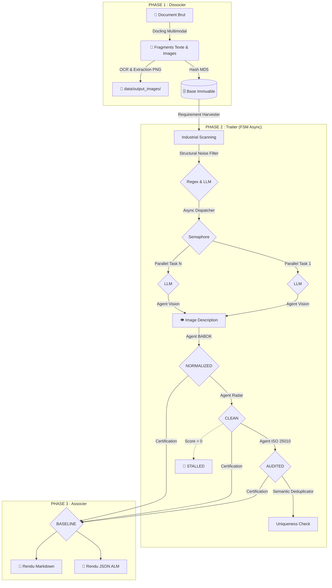

# 🏗️ Architecture Déterministe : FSM-Driven Engine

Ce document décrit l'organisation de l'Usine à RFP basée sur une Machine à État Finis, une exécution asynchrone et des capacités multimodales.

---

## 📊 1. Modèle Conceptuel (L'Usine en 3 Phases)

---

## ⚡ 2. Performance & Capacités Multimodales

L'usine est optimisée pour le traitement industriel et la compréhension visuelle :

- **Analyse Multimodale :** Le `LocalParser` extrait désormais les schémas et maquettes au format PNG. L'agent `VisionRequirementAgent` utilise des modèles comme Llama 3.2 Vision ou Gemini pour transformer ces images en spécifications textuelles avant leur normalisation BABOK.
- **Asynchronisme (asyncio) :** Toutes les phases de traitement LLM (Texte & Vision) sont asynchrones.
- **Contrôle de Flux (Semaphore) :** Un sémaphore limite la concurrence pour protéger la VRAM lors des appels Vision plus gourmands.
- **Auto-Switch Multi-LLM :** Bascule dynamique entre Ollama, Gemini et OpenRouter.

---

## 🎨 3. Certification & Produits de Sortie

La Phase 3 génère deux artefacts certifiés :

### A. Le Livrable Humain (`technical_baseline_final.md`)
Inclut désormais les exigences issues des schémas et les IDs officiels BN-XXX.

### B. Le Livrable Machine (`technical_baseline_alm.json`)
Contient l'historique complet, incluant la trace du passage par l'Agent Vision.

---

## 🛠️ 4. Intégrité, Sûreté & Observabilité

- **Project UID :** Sceau d'immuabilité global.
- **Dédoublonnage :** Fusion sémantique des fragments pour garantir l'unicité des exigences certifiées.
- **Observabilité :** `factory_logger` avec buffering mémoire.
