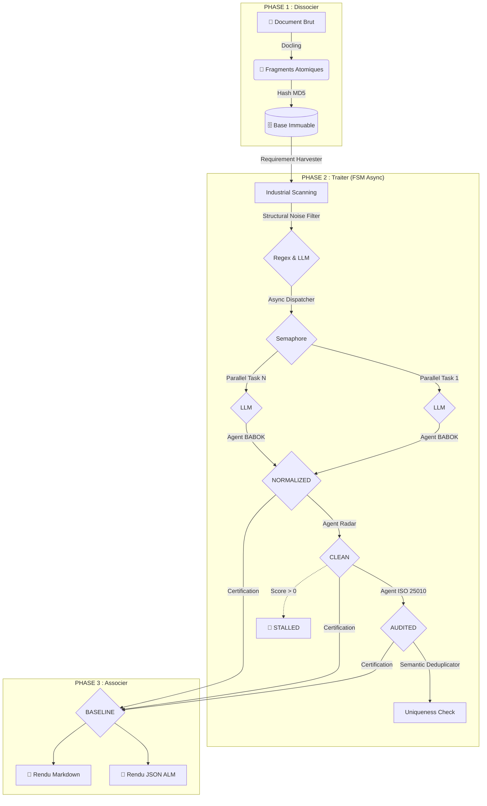

# 🏗️ Architecture Déterministe : FSM-Driven Engine

Ce document décrit l'organisation de l'Usine à RFP basée sur une Machine à État Finis et une exécution asynchrone haute performance.

---

## 📊 1. Modèle Conceptuel (L'Usine en 3 Phases)

---

## ⚡ 2. Performance & Gestion des Ressources

L'usine est optimisée pour le traitement industriel de documents volumineux (testée sur +1400 fragments) :

- **Asynchronisme (asyncio) :** Toutes les phases de traitement LLM sont asynchrones. Le `RequirementHarvester` distribue les tâches en parallèle sans bloquer le thread principal.
- **Contrôle de Flux (Semaphore) :** Un sémaphore limite le nombre de requêtes simultanées (`MAX_CONCURRENT_REQUESTS`) pour éviter la saturation de la VRAM (GPU) ou les blocages réseau.
- **Optimisation VRAM :** Pour les configurations locales modestes (4 Go VRAM), le système bride dynamiquement le contexte (`num_ctx: 1024`) et utilise des modèles optimisés comme `llama3.2:3b`.
- **Auto-Switch Multi-LLM :** Le moteur détecte dynamiquement les clés API (OpenRouter, Gemini) pour basculer de l'inférence locale vers le Cloud, garantissant une flexibilité totale.

---

## 🎨 3. Certification & Produits de Sortie (Output Node)

La Phase 3 génère deux artefacts certifiés dès que l'état **BASELINE** est atteint :

### A. Le Livrable Humain (`technical_baseline_final.md`)
Un document structuré avec matrice MoSCoW, score d'intégrité et catalogue complet.

### B. Le Livrable Machine (`technical_baseline_alm.json`)
Un fichier JSON structuré pour l'intégration ALM (Jira, DOORS).

---

## 🛠️ 4. Intégrité, Sûreté & Observabilité

- **Project UID :** Hash MD5 global garantissant l'immuabilité de la baseline.
- **Fail-Safe :** Mécanisme de retry asynchrone avec backoff exponentiel pour les erreurs de quota (429) ou de timeout.
- **Observabilité :** `factory_logger` centralisé avec système de **buffer mémoire** (flush toutes les 20 entrées) pour maximiser les performances I/O lors des traitements massifs.
