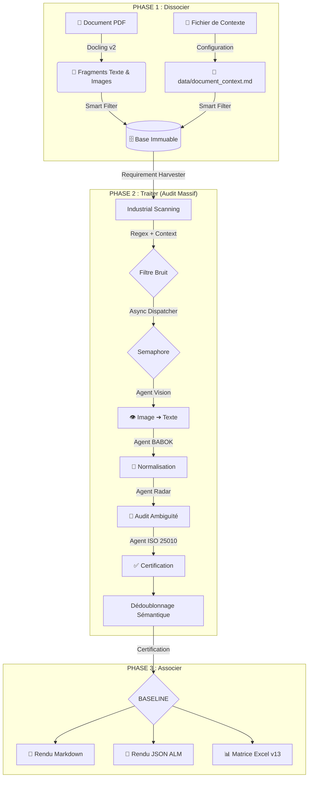

# 🏗️ Architecture Déterministe : FSM-Driven Engine (v13)

Ce document décrit l'organisation industrielle de l'Usine à RFP basée sur une Machine à État Finis, une exécution asynchrone et des capacités multimodales.

---

## 📊 1. Modèle Conceptuel (L'Usine en 3 Phases)

---

## ⚙️ 2. Le Cycle de Vie d'une Exigence (FSM)

Chaque fragment passe par un tapis roulant d'états :

| État | Robot Responsable | Description |
| :--- | :--- | :--- |
| **RAW** | `VisionAgent` | État initial. Transforme les images en texte brut si nécessaire. |
| **NORMALIZED**| `BABOKAgent` | Structure l'exigence : Sujet / Action / Objet (BABOK v3). |
| **CLEAN** | `WolfRadarAgent` | État atteint si le score d'ambiguïté est < 20. Sinon reste bloqué. |
| **AUDITED** | `ISO25010Agent` | Vérifie la complétude technique selon les standards ISO. |
| **BASELINE** | `Composer` | État final certifié. Éligible pour le catalogue de baseline. |
| **ERROR** | *Tous* | Exigence rejetée (Bruit, Hors-contexte, Administrative). |

---

## 🎯 3. L'Innovation `document_context.md` (Single Source of Truth)

Le pipeline v13 est devenu **agnostique**. Au lieu de configurer le code, l'utilisateur décrit son document en texte libre dans `data/document_context.md`.

- **Détection d'ID** : Les patterns comme `BN-XXX` ou `REQ-XXX` sont auto-détectés.
- **Adaptation des Prompts** : Si vous décrivez des "maquettes fils de fer", l'agent BABOK est briefé pour extraire les boutons et les champs comme exigences fonctionnelles.
- **Filtrage Intelligent** : Les patterns de bruit spécifiques (ex: headers répétitifs) sont filtrés selon la nature du document déclarée.

---

## ⚡ 4. Performance & Observabilité

- **Asynchronisme (asyncio)** : Le `RequirementHarvester` traite les fragments en parallèle.
- **Sémaphores** : Contrôle du flux (par défaut 2 requêtes concurrentes) pour protéger la VRAM du GPU local.
- **Logs Industriels** : `factory_log.py` avec buffering pour une traçabilité totale des transitions FSM.
