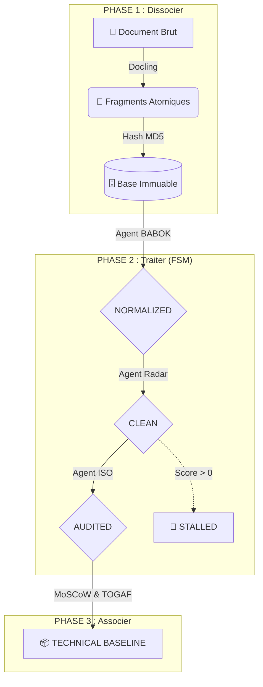

# 🏗️ Architecture Déterministe : FSM-Driven Engine

Ce document décrit l'organisation de l'Usine à RFP, construite sur une Machine à État Finis (FSM) pour garantir la sûreté de fonctionnement et l'auditabilité.

---

## 📊 1. Modèle Conceptuel (L'Usine en 3 Phases)

Le système est conçu pour transformer un document flou en une "Technical Baseline" exploitable. 

---

## 🔬 2. Cycle de Vie de l'Exigence (FSM)

Chaque fragment d'information est un objet `FSMRequirement` qui transite entre des états stricts :

| État Cible | Agent Responsable | Condition de Transition |
|---|---|---|
| **RAW** | `DoclingDecomposer` | Extraction structurelle réussie. |
| **CLASSIFIED** | `SemanticRouter` | Contexte métier affecté (ex: Sécurité). |
| **NORMALIZED** | `BABOKAgent` | Validation du format `Sujet + Action + Objet`. |
| **CLEAN** | `WolfRadarAgent` | **Score d'ambiguïté = 0** (Aucun adjectif flou). |
| **AUDITED** | `CompletenessAgent` | Inférence ISO 25010 effectuée (Gap Tickets générés). |
| **BASELINE** | `ArchitectureComposer` | Intégration dans le rendu ALM final. |

### 🛑 Logique de Blocage (Fail-Safe)
Si l'agent Radar détecte un terme qualitatif non mesurable (*"ergonomique, rapide, moderne"*), il **refuse** la transition vers l'état `CLEAN`. L'exigence est marquée comme `STALLED` et exclue de la Baseline jusqu'à intervention humaine.

---

## 🧠 3. Moteur de Recherche Hybride (RRF)

Pour le Retrieval (RAG), nous fusionnons deux index :
1.  **ChromaDB (Vectoriel)** : Embeddings pour le contexte sémantique.
2.  **BM25 (Textuel)** : Fréquence de termes pour les acronymes exacts (ISO 27001).

**Formule Reciprocal Rank Fusion (RRF)** :
`Score(d) = Σ (1 / (k + Rang(d, moteur)))`
*Avec une constante k=60. Ce qui garantit que seuls les fragments pertinents dans les deux domaines remontent à l'IA.*

---

## 🛠️ 4. Stack Technique & Immuabilité

- **Identifiants Déterministes** : Chaque fragment possède un ID `hashlib.md5(source + page + texte)`.
- **Dédoublonnage** : L'API ChromaDB utilise `.upsert()`. Une ré-ingestion du même PDF est idempotente.
- **Micro-Services** : Chaque Agent hérite d'une classe de base `FSMAgent`, permettant une composition de pipeline à la volée.
- **Orchestration LLM** : Ollama (`qwen2.5:7b`) avec `ThreadPoolExecutor` (pilotable via `OLLAMA_NUM_PARALLEL`).
