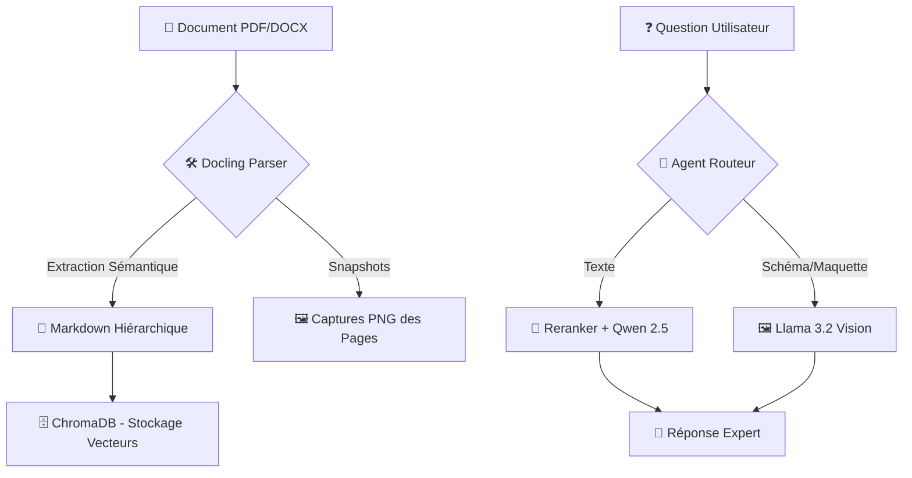

# 🏭 Augmented BID IA — Phase 1 : Ingestion & Analyse RFP

**Analysez vos appels d'offres localement, gratuitement et en toute confidentialité.**

---

### 🌟 C'est quoi ce projet ?
Ce logiciel est un assistant intelligent qui "lit" vos documents PDF (appels d'offres, contrats, cahiers des charges) et répond à vos questions en quelques secondes. 

**Pourquoi l'utiliser ?**
- **🔒 Privé** : Rien n'est envoyé sur Internet. Vos documents confidentiels restent sur votre PC.
- **🖼️ Multimodal** : L'IA comprend le texte MAIS aussi les schémas et les maquettes.
- **💰 Gratuit** : Utilise des modèles d'IA gratuits qui tournent sur votre propre machine.

> [!TIP]
> 🔰 **Nouveau sur ce projet ?** Lisez notre [Guide Débutant](./GUIDE_DEBUTANT.md) pour comprendre comment ça marche avec des mots simples.

### 📊 Flux de Traitement (Pipeline)



---

## 🚀 Fonctionnalités Avancées (pour les experts)
- **Parsing Hiérarchique (Docling)** : Découpage intelligent préservant la structure du document (breadcrumbs, sections).
- **Reranker Local (Secret Weapon)** : Utilisation de `FlashRank` pour une précision de recherche supérieure au RAG classique.
- **Routage Intelligent (Ollama)** :
    - **📝 Raisonnement Texte** : Propulsé par `qwen2.5:7b` pour les analyses juridiques et techniques.
    - **🖼️ Vision Cognitive** : Bascule automatique vers `llama3.2-vision` pour l'analyse des schémas et maquettes.
- **Zéro Cloud** : Indexation et raisonnement 100% locaux (Confidentialité totale).

## 📂 Structure du Projet

```text
.
├── extract/                 # 核心 Source Code (Le moteur)
│   ├── phase1/              # Logique métier de traitement
│   │   ├── local_parser.py  # Extraction structurelle via IBM Docling
│   │   ├── vectorstore.py   # Gestion de la base ChromaDB (Vecteurs)
│   │   ├── reranker.py      # Filtre de précision via FlashRank
│   │   ├── models.py        # Définition des objets de données
│   │   └── classifier.py    # Classification sémantique (Legacy)
│   ├── main.py              # Script d'ingestion (Apprend les PDF à l'IA)
│   ├── rfp_agent.py         # L'Agent Expert (Répond aux questions)
│   └── split_pdf.py         # Utilitaire pour découper les gros documents
├── data/                    # Données (Ignoré par Git)
│   ├── input/               # Vos PDF originaux
│   ├── output_images/       # Captures PNG des pages (pour la Vision)
│   ├── output_markdown/     # Versions texte structurées des PDF
│   └── chroma_db_hierarchical/ # La base de connaissances de l'IA
├── ARCHITECTURE.md          # Guide technique profond (Flux, RAG, Rerank)
├── AI_CONTEXT.md            # Mode d'emploi pour les autres IA
├── GUIDE_DEBUTANT.md        # Comprendre le projet avec des analogies
├── PROJECT_LOG.md           # État d'avancement et prochaines étapes
└── README.md                # Ce fichier (Présentation générale)
```

## 🛠️ Installation

1.  **Prérequis** : Python 3.10+, Ollama.
2.  **Modèles Ollama requis** :
    ```bash
    ollama pull qwen2.5:7b
    ollama pull llama3.2-vision
    ```
3.  **Dépendances** :
    ```bash
    pip install -r extract/requirements.txt
    ```

## 📋 Utilisation

### 📥 Ingestion Hiérarchique
```bash
./venv/bin/python extract/main.py --input data/input/votre_document.pdf
```

### 🧠 Agent Expert (Texte & Vision)
L'agent détecte automatiquement si vous parlez d'un schéma :
```bash
# Analyse textuelle
./venv/bin/python extract/rfp_agent.py "Quelles sont les pénalités de retard ?"

# Analyse visuelle
./venv/bin/python extract/rfp_agent.py "Décris-moi le schéma technique de la page 15"
```

## 🔒 Sécurité
Les données sensibles (.env, data/, bases vectorielles) sont exclues du dépôt via `.gitignore`.
