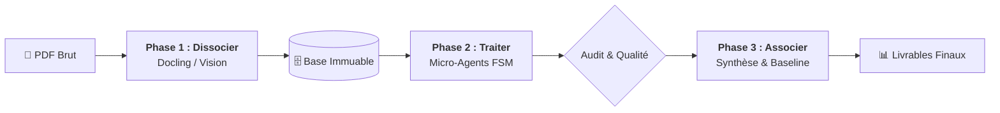

# 🏭 Augmented BID IA — L'Usine à RFP (v14 Générique)

**Transformez vos Appels d'Offres complexes en "Technical Baselines" certifiées. Une approche industrielle, déterministe et multimodale pilotée par une Machine à États (FSM).**

> **Nouveauté v14 :** Le pipeline est désormais 100% générique et auto-adaptatif. Il déduit automatiquement les filtres de bruit hors-domaine et les règles d'extraction normatives depuis votre description en texte libre, et intègre une déduplication sémantique avancée.

---

## 🏗️ Architecture du Pipeline



---

## 🚀 Workflow Industriel (Le 0-1-2-3-4)

### 0️⃣ Initialisation (Le Guidage)
Définissez la "Source de Vérité" pour votre projet.
```bash
python extract/main.py --init-context
# Modifiez 'data/document_context.md' pour décrire votre document (Type d'ID, Domaine, etc.)
```

### 1️⃣ Dissocier (Ingestion)
L'usine découpe le document en fragments atomiques (Texte + Images).
```bash
python extract/main.py --input data/input/mon_rfp.pdf
```

### 2️⃣ Traiter (Analyse FSM)
Les micro-agents (BABOK, Radar, ISO) auditent chaque fragment en parallèle.
```bash
python extract/requirement_harvester.py
```

### 3️⃣ Associer (Synthèse)
Génération des livrables techniques et ALM.
```bash
python extract/phase3/composer.py
```

### 4️⃣ Matrice (Conformité)
Production de la matrice Excel pour le chiffrage client.
```bash
python extract/phase3/excel_generator.py
```

---

## 📤 Livrables Certifiés

| Format | Nom du fichier | Usage |
| :--- | :--- | :--- |
| **Markdown** | `technical_baseline_final.md` | Revue humaine, catalogue élégant, priorités MoSCoW. |
| **Excel** | `Matrice_Conformite_RFP.xlsx` | Chiffrage, suivi client, tri par priorité. |
| **JSON** | `technical_baseline_alm.json` | Import machine (Jira, DOORS, ALM). |
| **Audit** | `granular_audit_report.md` | Rapport détaillé des ambiguïtés (Loups sémantiques). |

---

## 🤖 Agent Interactif (RAG)
Pour interroger votre document ou vos schémas en langage naturel :
```bash
python extract/rfp_agent.py "Quelles sont les contraintes de sécurité réseau ?"
```

---

## 🛡️ Standards d'Ingénierie
- **FSM-Driven** : Chaque exigence a un cycle de vie auditable (`RAW` ➔ `AUDITED`).
- **Vision Intégrée** : Analyse des schémas techniques et maquettes fils de fer.
- **Performance Async** : Traitement massif via `asyncio` (optimisé pour GPU 4Go+).
- **Multi-Cloud** : Support natif Ollama (Local), Gemini & OpenRouter (Cloud).
